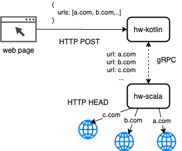

# Async HTTP Scanner

This is an experimental implementation of simple HTTP URL scanner with full async reactive stack. 
It consists of following microservices:
- hw-kotlin: Spring WebFlux + Kotlin + Flow Coroutines + gRPC
- hw-scala: Akka + Scala + gRPC

Simple HTML page is also being served as a part of WebFlux service. 
This web page acts as a streaming termination directly in user's browser.

# Architecture

# Prerequisites
- Docker for Mac (docker-compose in general should be enough)
- Available 8080 + 8980 ports (or you have to manually change it)

# How to run
- docker-compose up
- wait until all microservices properly start
- navigate to http://localhost:8080

# TODO
- fix scala Dockerfile to avoid long starting
- add configurable constants (ports, etc)
- add metrics, healthchecks
- add swagger documentation
- add Cypress UI test

